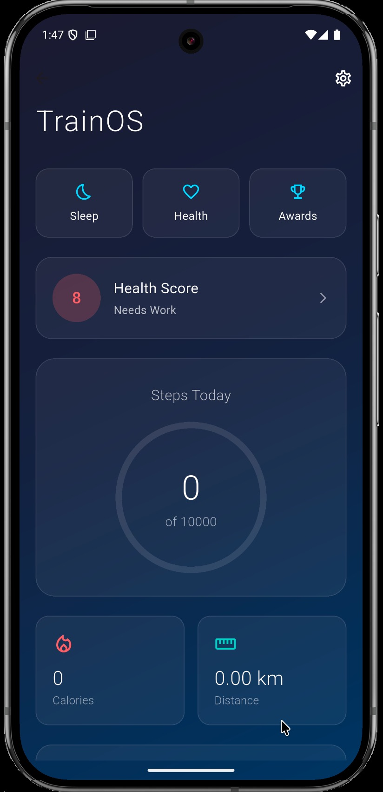

# TrainOS - Professional Fitness Tracking App

A comprehensive Flutter-based fitness tracking application with modern UI design, persistent step counting, sleep tracking, health analytics, and achievement system.

##  Screenshots

<div align="center">
  
  
</div>

## Features

### Core Functionality
- **Persistent Step Counting**: Steps are tracked continuously and persist even when the app is closed
- **Daily Reset**: Automatic step counter reset at midnight
- **Calorie Calculation**: Personalized calorie burn calculation based on user profile
- **Distance Tracking**: Accurate distance measurement using personalized step length

### Health & Wellness
- **Sleep Tracking**: Manual sleep logging with bedtime, wake time, and quality rating
- **Health Score Dashboard**: Comprehensive health scoring (0-100) based on multiple factors
- **Weekly Analytics**: Visual charts showing progress trends over time
- **Personalized Recommendations**: AI-driven health insights and suggestions

### Gamification
- **Achievement System**: Multiple achievement categories with point-based rewards
- **Progress Tracking**: Visual progress indicators and milestone celebrations
- **Consistency Rewards**: Special achievements for maintaining healthy habits

### Professional UI/UX
- **Dark Theme**: Modern gradient-based dark theme design
- **Smooth Animations**: Professional animations and transitions throughout the app
- **Intuitive Navigation**: Easy-to-use interface with quick action buttons
- **Responsive Design**: Optimized for various screen sizes

## 🔧 Installation

1. **Clone the repository**
   ```bash
   git clone https:/github.com/akshat2474/TrainOS
   cd TrainOS
   ```

2. **Install dependencies**
   ```bash
   flutter pub get
   ```

3. **Configure Android NDK** (if needed)
   
   Add to `android/app/build.gradle.kts`:
   ```kotlin
   android {
       ndkVersion = "27.0.12077973"
       compileOptions {
           sourceCompatibility = JavaVersion.VERSION_11
           targetCompatibility = JavaVersion.VERSION_11
           isCoreLibraryDesugaringEnabled = true
       }
   }
   
   dependencies {
       coreLibraryDesugaring("com.android.tools:desugar_jdk_libs:2.0.4")
   }
   ```

4. **Run the app**
   ```bash
   flutter run
   ```

## 📱 Permissions

### Android
The app requires the following permissions:
- `ACTIVITY_RECOGNITION` - For step counting
- `FOREGROUND_SERVICE` - For background step tracking
- `WAKE_LOCK` - To maintain step counting when device sleeps

### iOS
- `NSMotionUsageDescription` - For accessing motion data

## 🏗️ Project Structure

```
lib/
├── main.dart                
├── models/                 
│   ├── fitness_data.dart
│   ├── user_profile.dart
│   ├── sleep_data.dart
│   ├── achievement.dart
│   └── health_score.dart
├── services/                
│   ├── fitness_service.dart
│   ├── sleep_service.dart
│   ├── achievement_service.dart
│   └── health_score_service.dart
└── screens/                
    ├── splash_screen.dart
    ├── onboarding_screen.dart
    ├── profile_setup_screen.dart
    ├── home_screen.dart
    ├── sleep_tracking_screen.dart
    ├── health_dashboard_screen.dart
    └── achievements_screen.dart
```

### Persistent Step Counting
- Uses device's built-in pedometer
- Stores daily steps in SharedPreferences
- Handles app restarts and device reboots
- Automatic daily reset at midnight

### Health Score Algorithm
The health score is calculated based on:
- **Steps Score** (25%): Daily step goal achievement
- **Sleep Score** (25%): Sleep duration and quality
- **Activity Score** (25%): Overall activity level
- **Consistency Score** (25%): Goal achievement consistency

### Achievement System
- **Step Achievements**: 100, 5K, 20K daily steps
- **Sleep Achievements**: Quality sleep, early wake-up
- **Consistency Achievements**: 3-day, 7-day streaks
- **Point System**: Earn points for unlocking achievements

## Data Persistence

All user data is stored locally using SharedPreferences:
- User profile settings
- Daily fitness data (steps, calories, distance)
- Sleep logs with quality ratings
- Achievement progress and unlocked status
- Health scores and recommendations

## 📄 License

This project is licensed under the MIT License - see the [LICENSE](LICENSE) file for details.

## Author

**Akshat Singh**
- Email: akshatsingh2474@gmail.com
